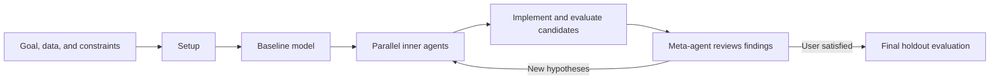

<h1 align="center">
  &nbsp;

  <b>automodel</b>
</h1>

[](LICENSE)


`automodel` is an agent **skill** for building or improving models from data. It searches for better model **structures** by transforming input features, introducing equation terms, or modifying neural network layers.

This skill takes inspiration from [Karpathy's autoresearch](https://github.com/karpathy/autoresearch), but generalizes the approach to guide users through domain-agnostic searches for model structures, potentially starting from data alone. It is intentionally minimal and flexible.
For more comprehensive model and program discovery approaches, consider [OpenEvolve](https://github.com/algorithmicsuperintelligence/openevolve), [ShinkaEvolve](https://github.com/SakanaAI/ShinkaEvolve), [SkyDiscover](https://github.com/skydiscover-ai/skydiscover), etc.

> 🚧 `automodel` is under construction and experimental. Use at your own risk.

## 🚀 Quick start

Copy the [`automodel/`](automodel/) folder into `.agents/skills/` (or `.claude/skills`). Or use  [Vercel Labs' `skills` package](https://github.com/vercel-labs/skills): `npx skills add unlayer-ai/automodel`.

> 📚 Add any relevant references in `.<agents-OR-claude>/skills/automodel/references/` if you wish to leverage background info.

Then give the agent a concrete modeling goal:

```text
Help me improve this cardiac fluid dynamics model using the automodel skill.

The data is in data/measurements.csv.

Minimize validation RMSE while keeping inference below 50 ms.

The final model should remain interpretable and produce non-negative outputs.
```

An existing model is optional. If none exists, the skill creates a baseline before starting the structural search.

## 👉 What you provide

| Input                      | Required? | Examples                                                        |
| -------------------------- | --------- | --------------------------------------------------------------- |
| Data or data-loading code  | Yes       | CSV files, database export, simulation input and expected output                   |
| Goal and evaluation metric | Yes       | Minimize RMSE, maximize accuracy, satisfy a physical constraint   |
| Existing model             | No        | Regression equation, PDE terms, neural network definition       |
| Constraints                | No        | Interpretable, differentiable, positive, bounded, latency limit |
| Domain references          | No        | Papers, code snippets, known equations placed in `references/`  |

The agent confirms the data split, metrics, parameter optimization routine, runtime, and memory budget before beginning the search.

## 👈 What you get

| Artifact                                 | Purpose                                                               |
| ---------------------------------------- | --------------------------------------------------------------------- |
| `CHECKLIST.md`                           | Progress through the four phases                                      |
| `CONTEXT.md`                             | Living record of decisions, experiments, final metrics, and findings  |
| `model.X`                                | Baseline and candidate model implementations                          |
| `meta_m/agent_s/attempt_i/evaluation.md` | Evaluation notes for each candidate                                   |

Candidate models and their evaluations remain available, so the result includes a documented search history rather than only the winning model.

## 🔄 How it works



During iteration, a meta-agent assigns distinct hypotheses to parallel inner agents. Each inner agent makes sequential structural changes, trains or calibrates each candidate, and evaluates it on the training and validation sets. The meta-agent then compares results, records what worked, and chooses the next search directions.

The held-back test set is used only in the final phase.

## 🧭 Phases

The skill is organized into four sequential phases. The agent uses each recipe's frontmatter to detect completed work and resume from the relevant phase.

| Phase | What happens | Entry signal |
|---|---|---|
| **1 - [Setup](automodel/assets/phases/1_setup.md)** | Confirm the goal and terminology, prepare data splits, define metrics, and set up parameter optimization. | No `CONTEXT.md` exists in the project root |
| **2 - [Baseline Model](automodel/assets/phases/2_baseline_model.md)** | Implement a simple parameterized baseline, test the full pipeline with a sub-agent, and verify that its outputs are plausible. | Set up work done and recorded in `CONTEXT.md` |
| **3 - [Iterate](automodel/assets/phases/3_iterate.md)** | Choose the loop parameters, explore structural modifications with parallel inner agents, review the results, and repeat as needed. | `CONTEXT.md` exists and the end-to-end pipeline is verified for the baseline model |
| **4 - [Finalize](automodel/assets/phases/4_finalize.md)** | Evaluate the best model on the held-out test set, decide whether to return to iteration or accept it, and record the outcome. | User is satisfied with validation performance and `CONTEXT.md` points to the best model |

The agent is asked to read only the YAML frontmatter of a phase file to confirm the right phase before loading the full recipe.

## 📈 Example outcome

A completed run produces a traceable progression from baseline to final model:

| Step                  | Example record                                             |
| --------------------- | ---------------------------------------------------------- |
| Baseline              | Initial structure and training/validation metrics          |
| Candidate attempts    | Structural change, rationale, metrics, runtime, and memory |
| Meta-iteration review | Changes that helped, failed attempts, and next hypotheses  |
| Final model           | Selected structure and untouched holdout test metrics      |

The repository does not yet publish benchmark results. Reproducible examples and measured case studies are planned as the skill matures.

## 🗂️ Skill structure

```
automodel/
  SKILL.md                    # Skill entry point and phase routing
  assets/
    CHECKLIST.md              # Progress-tracking template
    CONTEXT.md                # Living experiment record template
    phases/
      1_setup.md              # Goal, data, metrics, and optimization routine
      2_baseline_model.md     # Baseline and end-to-end pipeline check
      3_iterate.md            # Meta/inner-agent structural search
      4_finalize.md           # Holdout test evaluation and final decision
  references/                 # Optional domain papers, code, and other resources
  scripts/
    read_phases.sh            # Read phase frontmatter with bash/zsh
    read_phases.ps1           # Read phase frontmatter with PowerShell
```

If you want to dig into the details, start with [`automodel/SKILL.md`](automodel/SKILL.md), or inspect the [`CHECKLIST.md`](automodel/assets/CHECKLIST.md) and [`CONTEXT.md`](automodel/assets/CONTEXT.md) templates.

## ⚖️ License

Licensed under Apache License 2.0. See `LICENSE`.

## 📌 Notice

For redistributions and derivative works, preserve applicable notices from `NOTICE` as required by Apache License 2.0.

The use of "*discovered with automodel*" in any derivative works is kindly encouraged.

## ✍️ Citation

If you use `automodel` in your work, please consider citing:

```
@software{automodel,
  author = {Unlayer AI},
  title = {automodel: An Agent Skill for Discovering Models from Data},
  year = {2026},
  url = {https://github.com/unlayer-ai/automodel}
}
```
